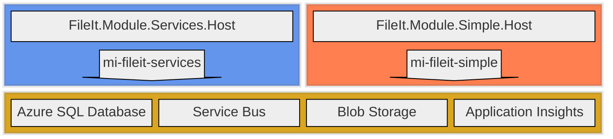

# cmeraz-fileit 
## Migrating a Windows service to Azure Service Bus

This repository illustrates with a working proof of concept how we might reshape a Windows service into Azure using native components that can be emulated in a local development environment. 

# Introduction
We have a basic "File Handler" Windows service in production that deserves more love than it's getting. It is well-architected, and the business logic is nicely isolated. The service runs multiple "provider" workflows and each workflow gets deployed separately. Its plug-in architecture allows for provider updates and enhancements with minimal down-time, yet the "always-on" nature of the service lacks in some areas.

# Problem Statement
Maintenance on the central Windows service has become associated with increased risk such that addressing its long-term enhancements comes at a considerable cost, its manual processes of "plug-in provider" testing and deployment invite human error as its technology nears the limits of modern observability, security, and distributed processing options now available in the cloud.

## Pain Points

### Deployment
Deployment is mostly manual, with an installer that has a UI to advance through coded steps in the setup process, extracting files from a compiled ServiceSetup.msi, and logging the progress of the installation.  Although the installer has a command line mode for unattended setup, no attempt has been made to fully automate a continuous deployment pipeline with this tool.  The ADO and now GitHub pipelines which build common artifacts do not yet fully automate extraction of the installation folder items to the target server or run a batch sequence to stop, install, and restart the service the way the setup UI does.  Due to the service design which locks participating DLLs during execution, when an ETL "provider" plug-in is installed, the service must be stopped along with any of the running providers, existing provider dll and config files are backed up from the application folder, the new files are copied to the application folder, and the service is started again manually.

### Unit tests 
There are only a few unit tests for this application, and the provider projects tend to have none. This main service solution contains over 40,000 Lines of Code, most of which is dedicated to the mechanics of the service, its shared integrations, and its scheduling. Much of this code is specific to interfacing external systems, and writing unit tests never became a priority.  Some work has been done to enhance logging and create validation utilities.  By employing Test-Driven Development, or TDD, we can engineer repeatable tests paths for individual components as well as full integration workflows to ensure valid processing of both successful imports and expected failures.

### Logging
Because the current service has no companion UI, Windows Server logs are our only view into its health and performance. The service providers take care of all plug-in logging through an injected singleton reference with its own signature, and the service "interfaces" library delineates the sinks by log level. We have since wrapped this logging fuinctionality in an ILogger interface, but we’d prefer it if the standard ILogger were more extensible and utilized Serilog or NLog to manage the sinks. This would allow developers to not think about logging and do it frequently, although a minimum standard of progress and failure point logging should be maintained.

### Execution
Asynchronous method signatures would suit this kind of application perfectly, and this .NET Framework 4.8 app could have been written to take advantage of it, but the original authors may have found it unnecessary at the time, opting for running each provider sequentially on its own thread. The consequences of that decision are evident: processes run long and are vulnerable to concurrency issues and exceptions. The service initializes all plug-ins in parallel at startup and then relies on a loop of "next action" evaluations in each provider to proceed from a watch condition to eventual ETL processing.  This occasionally results in error messages based on resource contention.

### MS SQL Server Integration Services (SSIS) Dependencies
Many of the providers utilize SSIS packages, which are executed through a custom wrapper that calls the Microsoft.SqlServer.Dts.Runtime API. This is a very expensive dependency to maintain, and it is not a technology that developers are eager to master. The packages themselves are developed in Visual Studio with the SQL Server Data Tools extension, and they are stored in the file system as .dtsx files. The service executes these packages by loading the .dtsx file into memory and calling its Execute method. This is a very heavy operation, and although more suited to Azure Data Factory migration, may lead to complications and readability issues if not refactored. A better approach would be to rewrite these package steps with additional SQL procedures and Azure Function workflow classes, depending on their complexity.

### Single repository
Each plug-in has its own repository with a reference to the "Interfaces" library. This makes it easy to dedicate a build pipeline for each plug-in, but it comes at a cost to overall maintenance. Since developers typically just open the plug-in solution, they aren’t always aware of design patterns established in other repositories. The result is a variety of poorly-documented patterns that complicate refactoring efforts.

### Observability
Apart from the logging that we write to Event Viewer and to the database, we don’t have an in-depth view of the application’s health or an understanding of root cause when there’s a failure. In addition, to view the logs in either sink, we currently need an incident ticket and request an engineer and/or a DBA to view the server logs in higher environments. A new "File Handler" version which supports file-level logging promises to make read-only diagnosis of key events more accessible, but this has yet to be fully tested against all providers. This is more a complaint about how our own rules on accountability get in our way, but a rewrite of the service could include more thoughtful structures to help expedite root cause analyses and eliminate obstacles.

### Reliability
As an on-premise solution, the organization is responsible for uptime, failover, backups, patching, and other measures to avoid disaster and reputation risk. Needless to say, these measures have been neglected, technical debt has accrued, and many developers are hoping that a migration to the cloud will save them the trouble.  Realistically, environment provisioning, refactoring of SSIS packages, and migrating API dependencies could easily become another year-long effort, so this proof-of-concept should detail the happy path for common use cases while building an environment suitable for both green field projects and legacy provider optimization.

### Heavy loads
Big jobs are a frequent and embarrassing challenge for the application. The operating system sometimes fails in scaling to occasions of high demand, funneling thousands of instructions from a few assemblies with limited memory space through a single service executable, it can choke at unpredictable times. In this case, its failure is its own doing; a better designed application could achieve load leveling and queue independent API calls in an orderly fashion.

### Development setup
Developing for this application isn’t the easiest task. Developers get the latest on the service and the plug-in repositories. They monkey with post-build events and application startup in order to replicate the service operation and debug the plug-in. Since Windows service and plug-ins are separate repositories, the post-build event script forces developers to conform the relative paths of their local repositories to a standard. 

These are the main drivers for a rewrite, and many of these issues could be reduced or resolved by migrating the Windows service to the cloud, in our case Azure. But apart from spinning up an expensive VM in a lift-and-shift exercise, we could reshape the application to fit native components for a cheaper, serverless, low maintenance solution with continuous deployment as the norm for live updates.

# Technical Requirements
The Windows service is a technology that strives to meet a business demand but not every aspect of Windows services is a requirement. When trying to approximate the functionality that it offers, we should improve on technical decisions based on legacy limitations and extract what directly serves future use cases. For example, the Windows service logs to the server Event Viewer, which we no longer rely on when running in the cloud can move to other logging stores. 

## Execution Timing
* Batch processing is adequate, near-real time can be accommodated, but streaming or real-time is out of scope.

## Observability
* Traceability through all operations is imperative to finding root cause for failure.
* A centralized logging table is required for end-to-end traceability and monitoring trends across all workflows.

## Controls
* Ability to pause processes for maintenance.
* Scale out in peak loads and load level to avoid API congestion downstream.
* Ability to retry or else park failed processes for review.

## Configuration
* host.json is for function settings
* appsettings.json is for non-sensitive application settings, specific to each module
* Application Settings in Azure Portal for connection strings, and values accessible both developers and engineers during runtime
* local.settings.json for these Application Settings in a non-Azure/local debug environment

## Structure
* Separate the application in the abstract from the infrastructure details, such that the path to changing cloud platforms is well known and contained to specific areas.
* Each workflow should have a separate application boundary and each feature of that workflow should have a separate logical boundary.
* There must be clarity from each line of business on how failures should be treated, so that the application handles exceptions appropriately, however, a global strategy should exist to handle exceptions that otherwise evade capture.
* Each workflow should have its own core functionality – including an executable, configuration, dependency injection, and database access – to ensure independent operation.

## Testing
* Unit test projects serve multiple masters: enforcing architectural and functional requirements, ensuring quality, and acting as a gatekeeper in the devops pipeline. Each project must have a companion unit test project that tests code in isolation, without downstream effects.
* Integration test projects automate complex use cases and should cover application projects.
* Architecture test projects automate enforcement that project references maintain Clean Architecture standards.
* The solution must run and test in a local environment without depending on components in the cloud, except for APIs. Emulators, such as Azurite and the Service Bus emulator, should be preferred over connecting directly to cloud components.

## Network
* Assume the application executes in an internal hybrid network (on-prem and cloud), and needs ability to call external APIs via the public web.

## Security
* Encryption in transit and at rest.
* Move connection strings away from config files and into environment variables and go passwordless.

# Solution
To replace the legacy system, we use these native Azure components 
1. Flex Consumption tier Function Apps for application logic, each representing module boundaries
2. Blob Storage for file handling
3. Azure SQL Database for tracing requests
4. Service Bus for load leveling with queues and decoupling with topics
5. Application Insights for system observability
6. User defined managed identities for security

In addition to these cloud components, we prescribe these components for a local development environment:
1. .NET 10 (dotnet-isolated) function apps running locally with [Azure Functions Core Tools](https://github.com/Azure/azure-functions-core-tools)
2. SQL Server 2025 Developer Edition for [Windows](https://www.microsoft.com/en-us/sql-server/sql-server-downloads) or for [Linux](https://learn.microsoft.com/en-us/sql/linux/sql-server-linux-setup?view=sql-server-ver17)
3. Azurite to emulate Blob Storage. I use the [VS Code Extension](https://learn.microsoft.com/en-us/azure/storage/common/storage-install-azurite?tabs=visual-studio-code%2Cblob-storage) but you can install it [globally with npm](https://learn.microsoft.com/en-us/azure/storage/common/storage-install-azurite?tabs=npm%2Cblob-storage)
4. Service Bus Emulator running in [Docker](https://docs.docker.com/desktop/). The docker compose file is included in this repo under /emulator

These components simulate the complete Azure environment so that you can develop everything locally without a cloud-hosted dependency. 

# Next
- [Understand](./docs/architecture.md) the system design.
- [Signup](./docs/contribute.md) for hackathon and join my team.
- [Setup](./docs/local.md) an instance of this system on your local machine.
- [Provision](./docs/provisioning.md) this system to Azure following notes from my experience.
- [Digest](./docs/nomenclature.md) its naming conventions.
- [Extend](./docs/extensions.md) this system with a new Module.
- [Deploy](./docs/deployment.md) your new Module to Azure and sync database changes.
